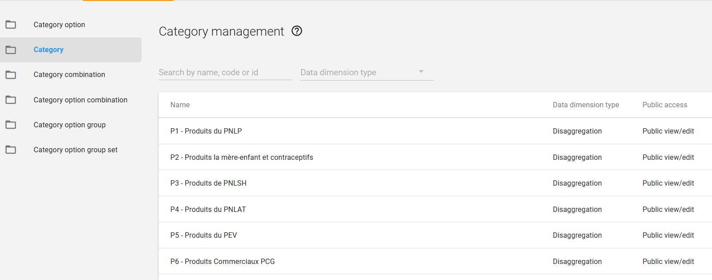

# Synchronize eLMIS products and program  in DHIS2.
After successful synchronization of the data between eLMIS and DHIS2, the metadata will  be created in DHIS2 as described below:

* All products are category options

* All products are categories which contains the products (categoryOptions)

Then

* Products are catcomboOptions. No combination with others elements or product from the other group.

