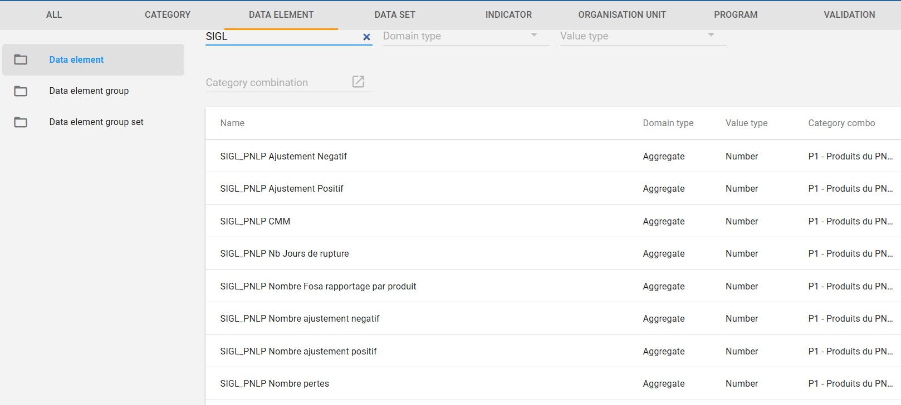
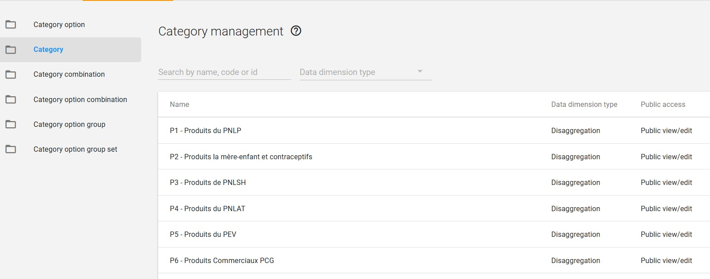

# Synchronize eLMIS products and program  in DHIS2.
After successful creation of metadata related to the requisitions, they will look like this:

* All eLMIS variables of the R&R are defined as data element 

* All variables are grouped by program 

