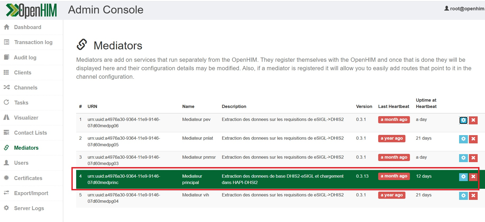
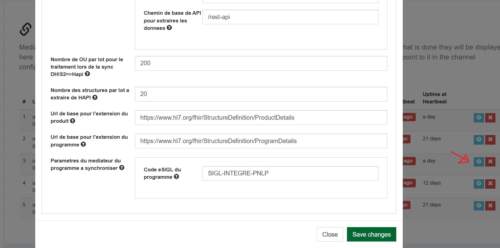
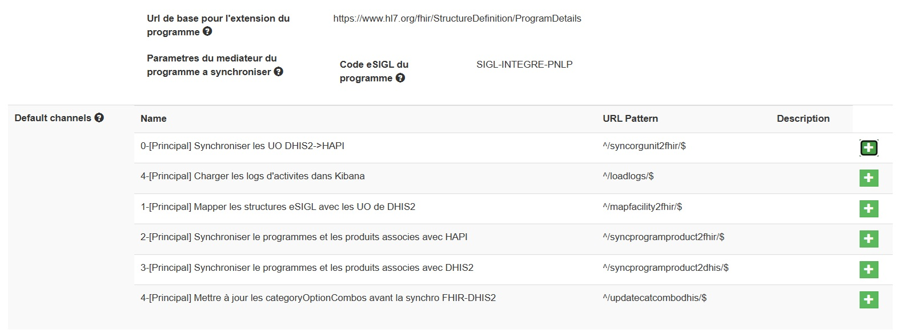

# Register a mediator in openHIM console.
When setting the parameter "register: true' either in config.json or env.list, the mediotor will send the request for registration to the openHIM.

if everything is OK, we should see this in "Mediators" menu of openHIM Console
## Step 1: Check if the mediator is registered successfuly 
Mediator register successfully 

In the image above, the mediator 'mediator-principal' has been successfuly register in openHIM.
Login in openHIM Console on _'http://localhost:port'_ and navigate to the _'Mediator page'_

## Step 2. Edit mediator configuration 
The mediator configurations variables can be edited based on the need. Click on the gear button to set up the parameters based on your need.
> [!IMPORTANT]
> OpenHIM console through its web UI, is the only approach that allow to change the configuration of mediator without reinstalling the mediator.

## Step 3. Setup channels
A channel defines a path that a request will take through the OpenHIM to run a process. The process related to ETL works are triggered through a call to channels. [Link](https://openhim.org/docs/configuration/channels) to learn  about openHIM channel.
Once the mediator is registered the channel need to be created, each mediator has a defined number of channels based on the use cases.
To create the channels,navigate to the _'Mediator page'_,  the click on mediator, go to the default channel section and click on _ '+'_ to install the channels.

> [!NOTE]
> Naming pattern of the channel: _operation-sequence-number-[mediatorcode]-description-of-the-operation_
Leave the default configuration.
## Monitor the mediators activities
Once the mediator is running,  navigate to the _'Transaction log '_ to view channels logs and _'server log'_ to view the mediators and core system logs.